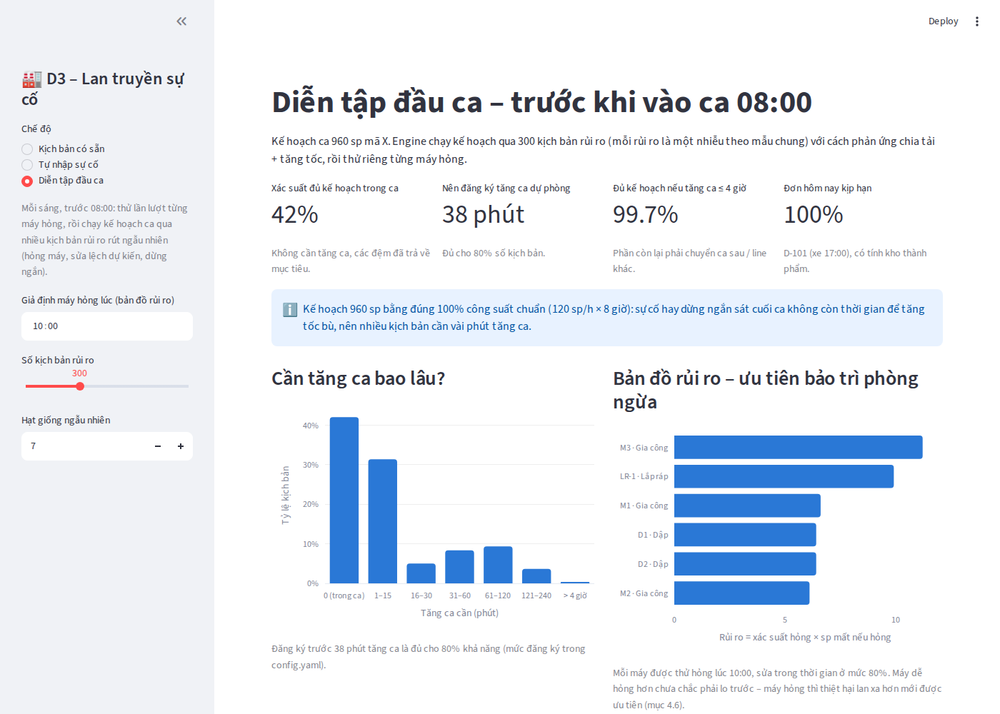

# D3 – Chain Impact Propagation

**Liên kết dữ liệu chuỗi sản xuất, dự đoán tác động lan truyền và gợi ý hành động cho từng bộ phận.**
Bài dự thi DENSO Factory Hacks 2026 – đề D3.

> War Room cho biết **bây giờ** ra sao. Hệ thống này cho biết **các giờ tới** sẽ ra sao và **nên làm gì** – cho từng
> bộ phận, trên cùng một nguồn số liệu, trong vòng 1 phút.

## 🚀 Thử ngay

**Demo online: https://denso-d3.streamlit.app/** – mở bằng trình duyệt, không cần cài đặt hay đăng nhập.

- Nếu thấy màn hình *"This app has gone to sleep"*: bấm **"Yes, get this app back up!"** và chờ khoảng 1 phút
  (bản miễn phí tự ngủ khi lâu không có người mở).
- Nên xem trên máy tính, cửa sổ rộng từ 1280 px trở lên.


---

## Mục lục

1. [Bài toán và ý tưởng](#1-bài-toán-và-ý-tưởng)
2. [Hướng dẫn xem demo trong 5 phút](#2-hướng-dẫn-xem-demo-trong-5-phút)
3. [Bốn chế độ của demo](#3-bốn-chế-độ-của-demo)
4. [Đọc một trang sự cố](#4-đọc-một-trang-sự-cố)
5. [Tám kịch bản có sẵn](#5-tám-kịch-bản-có-sẵn)
6. [Tự nhập sự cố](#6-tự-nhập-sự-cố)
7. [Engine hoạt động thế nào](#7-engine-hoạt-động-thế-nào)
8. [Chạy trên máy của bạn](#8-chạy-trên-máy-của-bạn)
9. [Cấu trúc repo](#9-cấu-trúc-repo)
10. [Kiểm thử](#10-kiểm-thử)
11. [Giả định và giới hạn](#11-giả-định-và-giới-hạn)
12. [Cập nhật bản online](#12-cập-nhật-bản-online)

---

## 1. Bài toán và ý tưởng

Nhà máy chạy theo chuỗi bốn khâu phụ thuộc nhau: **Kế hoạch → Cấp linh kiện → Vận hành máy → Giao hàng**. Khi một
máy dừng, ảnh hưởng lan dọc chuỗi, nhưng dữ liệu các khâu rời rạc nên Kế hoạch, Bảo trì và Giao hàng mỗi bên tự tính
tay – chậm, dễ sai và có thể ra ba con số khác nhau cho cùng một sự cố.

Ý tưởng cốt lõi:

1. **Dựng nhà máy thành bản đồ dòng chảy có quy tắc.** Máy, công đoạn, tồn đệm, linh kiện, người, đơn hàng, xe giao,
   khách là các điểm nối với nhau theo quan hệ phụ thuộc.
2. **Mọi sự cố quy về một mẫu chung:** `tại điểm · đại lượng · thay đổi · từ lúc · trong bao lâu`, với đại lượng là
   năng lực, nguồn cung, nhu cầu, thời gian hoặc chất lượng. Gặp loại sự cố mới chỉ cần mô tả theo mẫu, không phải viết
   quy trình xử lý mới.
3. **Tác động = mô phỏng có sự cố − mô phỏng theo kế hoạch.** Engine chạy thử tương lai từng phút.
4. **Hành động khắc phục cũng là một "nhiễu"** (chia tải, tăng tốc, đổi thứ tự, tăng ca, điều người, tách lô…). Mỗi
   phương án được chạy lại để ra số sản phẩm cứu được, giờ tăng ca, chi phí và mức xáo trộn. **Con người chọn.**

Tài liệu ý tưởng đầy đủ: [`IDEA.md`](IDEA.md) (bản gốc: [`D3_Y_tuong_va_giai_phap.docx`](D3_Y_tuong_va_giai_phap.docx)).

---

## 2. Hướng dẫn xem demo trong 5 phút

| Bước | Làm gì | Để thấy điều gì |
|---|---|---|
| 1 | Mở demo, ở chế độ **Tổng quan** | 8 kịch bản trên một màn hình: mỗi thẻ có mẫu sự cố, mức cảnh báo, sản lượng nếu không làm gì / nếu làm theo đề xuất, giờ tăng ca. |
| 2 | Bấm **Mở Ví dụ gốc →** (máy M2 hỏng 4 giờ) | Trang sự cố đầy đủ: 4 chỉ số, ô đề xuất, bản đồ lan truyền, các phương án, câu trả lời cho từng bộ phận. |
| 3 | Ở mục **01**, bấm **▶ Phát từ lúc sự cố** | Xem sự cố lan dần theo từng 10 phút: đệm cạn, công đoạn sau đói hàng, đơn bị đe dọa. Chuyển **"Nếu không làm gì" ↔ "Nếu làm theo đề xuất"** để so sánh. |
| 4 | Mở **TH3** (lô linh kiện về trễ) | Sự cố ở khâu cấp linh kiện **lan ngược** làm đứng cả chuyền; engine so 5 phương án và giải thích vì sao chọn "NCC tách lô". |
| 5 | Mở **TH7** (xe giao trễ) | Sự cố ở cuối chuỗi: sản xuất không đổi, đề xuất là phương án giao hàng (thuê xe ngoài). |
| 6 | Chế độ **Tự nhập sự cố** | Tự mô tả một sự cố bất kỳ – cùng một engine tính, không có code riêng cho từng loại. |

---

## 3. Bốn chế độ của demo

Chọn ở thanh bên trái.

| Chế độ | Dùng để |
|---|---|
| **Tổng quan** | Xem nhanh cả 8 kịch bản, bấm thẻ để mở chi tiết. |
| **Kịch bản có sẵn** | Chọn 1 trong 8 kịch bản trong ô "Chọn kịch bản" (có biểu tượng mức cảnh báo). |
| **Tự nhập sự cố** | Mô tả sự cố theo mẫu chung, có thể chồng nhiều sự cố (xem [mục 6](#6-tự-nhập-sự-cố)). |
| **Diễn tập đầu ca** | Chạy **trước khi có sự cố**: thử lần lượt "nếu máy này hỏng thì sao" để xếp hạng máy rủi ro nhất, đề xuất mức đệm tối thiểu, và tính xác suất hoàn thành kế hoạch ca bằng nhiều kịch bản rủi ro ngẫu nhiên (chỉnh số kịch bản và hạt giống ở thanh bên). |



---

## 4. Đọc một trang sự cố

Từ trên xuống:

**Đầu trang**
- **Mức cảnh báo** và danh sách bộ phận được báo:
  - 🟢 **Xanh** – chỉ cần chia tải / tăng tốc, không tăng ca, đơn vẫn đủ → báo Bảo trì;
  - 🟡 **Vàng** – cần tăng ca, đổi thứ tự hoặc điều người, đơn vẫn kịp → thêm Kế hoạch;
  - 🔴 **Đỏ** – không phương án nào giữ được đơn → thêm Giao hàng & Sales.
  Sự cố giao hàng (xe trễ) luôn báo cả Giao hàng & Sales.
- **4 chỉ số:** sản lượng dự đoán lúc 16:00, số thiếu so với kế hoạch, giờ tăng ca đề xuất, và **⏱ đồng hồ quyết
  định** – phải chốt phương án muộn nhất lúc mấy giờ, sau đó mỗi phút chậm mất bao nhiêu.
- **Ô đề xuất** (viền xanh): phương án được chọn, số cứu được, chi phí, mức xáo trộn.

**01 – Sự cố lan ra sao.** Bản đồ dòng chảy dạng làn song song:
- làn trên cùng **Bán thành phẩm** (Dập → Đệm B1 → Gia công → Đệm B2) dùng chung cho mọi mã;
- mỗi mã (X, Y) một làn: nhà cung cấp → linh kiện → **Lắp ráp** (cột GỘP, nơi bán thành phẩm + linh kiện thành sản
  phẩm) → kho thành phẩm → đơn hàng → xe giao → khách;
- thanh mức: phần tô = đang có, vạch trắng = mức mục tiêu của đệm; viền trắng + ⚡ = điểm xảy ra sự cố; đường đỏ = sự
  cố đã lan tới;
- mục **"Cách đọc luồng trên bản đồ"** (bấm để mở) giải thích chi tiết; bên dưới là dòng thời gian diễn biến.

**02 – Thang xử lý.** Mỗi thẻ là một lần chạy thử tương lai: sản lượng 16:00, số cứu được, giờ tăng ca, chi phí, mức
xáo trộn, giữ được đơn hay không. Kèm biểu đồ sản lượng cộng dồn (vùng tô = phần cứu được) và biểu đồ đồng hồ quyết
định cho từng phương án. Sự cố giao hàng có thêm hàng thẻ **phương án giao hàng**.

**03 – Phương án đề xuất: vì sao chọn và tối ưu thế nào.** Sinh tự động từ chính các con số ở mục 02:
- *Vì sao chọn* – thắng ở bước nào của luật chọn (xem [mục 7](#7-engine-hoạt-động-thế-nào));
- *Vì sao không chọn phương án khác* – lý do loại từng phương án, kể cả đánh đổi thật (ví dụ "rẻ hơn nhưng tăng ca
  nhiều hơn");
- *Tối ưu thế nào* – cách làm, số giờ máy chạy trên chuẩn so với giới hạn, số lần đổi mã, thứ tự sửa máy, giờ tăng ca,
  chi phí tách theo khoản.

**04 – Câu trả lời cho từng bộ phận.** Ba tab **🔧 Bảo trì**, **📋 Kế hoạch sản xuất**, **🚚 Giao hàng & Sales**:
mỗi bộ phận nhận đúng câu trả lời mình cần, từ cùng một nguồn số liệu (thứ tự sửa máy, cửa sổ bảo dưỡng, giờ tăng ca
theo từng khả năng thời gian sửa, tình trạng từng đơn, phương án giao hàng…).

**05 – Chi tiết kỹ thuật.** Biểu đồ Gantt trạng thái công đoạn, mức đệm và linh kiện theo thời gian, bảng số, và đối
chiếu với con số trong `IDEA.md` – cho người muốn kiểm tra từng con số.


---

## 5. Tám kịch bản có sẵn

Cùng một dây chuyền giả định (mục 6 của `IDEA.md`): **Dập** (D1, D2) → Đệm B1 → **Gia công** (M1–M3) → Đệm B2 →
**Lắp ráp** (1 chuyền, 6 người) → kho thành phẩm. Ca 08:00–16:00, kế hoạch 960 sp mã X; mã X dùng linh kiện L-A, mã Y
dùng L-B. Đơn: D-101 (500 X, xe 17:00 hôm nay), D-102 (460 X, ngày mai), D-201 (900 Y, ngày mai).

| Kịch bản | Sự cố | Mức | Không làm gì → Đề xuất (sp) | Tăng ca | Đề xuất | Điều đáng xem |
|---|---|---|---|---|---|---|
| Ví dụ gốc | M2 hỏng 4 giờ | 🟡 | 800 → 884 | 38′ | Chia tải + tăng tốc | Bảng tăng ca theo từng khả năng thời gian sửa (3/4/5/6 giờ). |
| TH1 | M3 chạy chậm 40 → 30 sp/h | 🟢 | 890 → 950 | 0′ | Chia tải | Engine tự chạy trước kịch bản xấu "nếu M3 hỏng hẳn" để cảnh báo sớm. |
| TH2 | M2 và D1 hỏng cùng lúc, một tổ bảo trì | 🟡 | 720 → 792 | 104′ | Chia tải, sửa D1 trước | Thứ tự sửa quyết định bởi thiệt hại lan truyền, không phải cảm tính. |
| TH3 | Lô L-A về trễ 5 giờ | 🟡 | 520 → 960 | 0′ | NCC tách lô (gửi trước 450 L-A) | Sự cố lan ngược làm đứng cả chuyền; ngưỡng thời gian an toàn của lô. |
| TH4 | Khách chèn đơn gấp 300 sp | 🟡 | 960 → 1 020 | 120′ | A: tăng tốc ca chính + tăng ca | Trả lời câu hỏi kinh doanh "nhận được không" kèm cái giá cụ thể. |
| TH5 | Lắp ráp thiếu 2/6 người | 🟡 | 640 → 760 | 120′ | A: điều 1 người từ line 2 | Kiểm tra tác động lên line cho mượn người. |
| TH6 | Phát hiện hàng lỗi | 🟡 | 832 → 864 | 48′ | Chia tải + tăng tốc | Truy vết ngược khoanh vùng 88 sp thay vì cả lô 600, rồi tính xuôi. |
| TH7 | Xe giao trễ 2 giờ | 🟡 | 960 → 960 | 0′ | Thuê xe ngoài chạy đúng giờ cũ | Sự cố cuối chuỗi; kiểm tra kho thành phẩm có đầy (lan ngược) không. |

Số liệu trong bảng do engine tính và được khóa bằng test (xem [mục 10](#10-kiểm-thử)).

---

## 6. Tự nhập sự cố

Ở thanh bên trái, điền mẫu chung rồi bấm **➕ Thêm**. Có thể thêm nhiều sự cố chồng nhau; **🗑 Xóa hết** để làm lại.

| Ô | Ý nghĩa |
|---|---|
| **Đại lượng** | Năng lực (máy hoặc cả công đoạn), Nguồn cung (linh kiện), Nhu cầu (đơn gấp theo mã), Thời gian (xe giao), Chất lượng (giữ hàng nghi lỗi). |
| **Tại điểm** | Danh sách thay đổi theo đại lượng: máy D1…LR-1, công đoạn, linh kiện L-A/L-B, mã X/Y, xe XE-A. |
| **Thay đổi** | % năng lực / % lượng hàng về (−100 = mất hẳn), số sản phẩm thêm, số giờ trễ hoặc số sản phẩm bị giữ. |
| **Từ lúc** | Giờ bắt đầu, bước 10 phút. |
| **Trong bao lâu** | Số giờ (chỉ cho năng lực và nguồn cung); 0 = chưa rõ / đến hết ca. |
| **Hạn giao** | Chỉ cho đơn gấp. |

Hai ví dụ để thử:

- **M1 hỏng 3 giờ:** Năng lực · M1 · −100 · 11:00 · 3.
- **Đơn gấp chồng lên máy hỏng:** thêm sự cố trên, rồi thêm Nhu cầu · X · 200 · 10:00 · hạn 20:00.

---

## 7. Engine hoạt động thế nào

- **Lớp Logic:** đồ thị có hướng (networkx) gồm máy, công đoạn, đệm, kho, linh kiện, nhà cung cấp, mã hàng, đơn, khách,
  xe và tổ người. Thứ tự dòng chảy lấy bằng sắp xếp topo, nên thêm công đoạn hay đệm chỉ cần sửa `config.yaml`.
- **Lớp Nghiệp vụ:** mô phỏng bước 1 phút. Sản lượng mỗi công đoạn = min(năng lực, đầu vào trong đệm trước, linh kiện,
  chỗ trống ở đệm sau) → sự cố lan cả xuôi (đói hàng) lẫn ngược (bị chặn). Quy tắc đã cài: chạy trên chuẩn tối đa
  6 giờ/ca, tăng ca tối đa 4 giờ ở tốc độ chuẩn, tiêu hao linh kiện theo BOM, đổi mã 20 phút.
- **Sản lượng hiệu dụng:** tính tại nút cổ chai và trừ phần đệm bị rút dưới mức mục tiêu – rút đệm không được tính là
  "cứu" sản lượng, vì ca sau phải trả lại.
- **Kiểm tra đơn hàng:** đơn hôm nay phải đủ trước giờ xe; đơn ngày mai phải vừa một ca (tính cả đổi mã và bù đệm) và
  phải đủ linh kiện (tồn cuối ngày + lô về trước ca mai).
- **Luật chọn phương án đề xuất:** trong các phương án **giữ được mọi đơn**, chọn phương án
  1. ít tăng ca nhất → 2. bậc thấp nhất trên thang xử lý → 3. ít xáo trộn kế hoạch nhất → 4. rẻ nhất.

  Sự cố giao hàng chọn phương án giao **kịp hạn và rẻ nhất**. Hệ thống chỉ đề xuất; con người quyết định.
- **Thang xử lý:** chia tải → tăng tốc → đổi thứ tự → tăng ca → chuyển line / ca sau → báo khách.

Chi tiết kỹ thuật (đồng hồ quyết định, diễn tập đầu ca, kết quả đối chiếu với tài liệu): [`demo/README.md`](demo/README.md).

---

## 8. Chạy trên máy của bạn

Cần **Python 3.10+** và Git.

**Windows – cách nhanh nhất:**

```bash
git clone https://github.com/huynhhoang124/denso2026.git
```

Rồi bấm đúp `denso2026\demo\run.bat`: cài thư viện, chạy test, mở giao diện tại http://localhost:8501.

**Mọi hệ điều hành – từng lệnh:**

```bash
git clone https://github.com/huynhhoang124/denso2026.git
cd denso2026
python -m pip install -r demo/requirements.txt pytest
python -m pytest -q demo
python -m streamlit run demo/app.py
```

Lưu ý:
- Chạy `streamlit` **từ thư mục gốc repo** để nạp giao diện tối trong `.streamlit/config.toml`.
- Khi app đang chạy, Streamlit chỉ tự nạp lại `app.py`. Sửa `engine.py`, `scenarios.py` hay `config.yaml` thì phải tắt
  và chạy lại.
- Muốn thử dây chuyền khác: sửa `demo/config.yaml` (máy, công suất chuẩn/tối đa, đệm, linh kiện, đơn hàng, xe, đơn
  giá). Các thông số tài liệu không nêu đều có ghi chú "giả định demo".

---

## 9. Cấu trúc repo

```
denso2026/
├── README.md                     ← file này
├── IDEA.md                       ← ý tưởng và giải pháp (bản Markdown)
├── D3_Y_tuong_va_giai_phap.docx  ← bản gốc
├── HANDOFF.md                    ← ghi chú chuyển giao giữa các phiên phát triển
├── .streamlit/config.toml        ← giao diện tối "War Room"
└── demo/
    ├── app.py                    ← giao diện Streamlit (tiếng Việt)
    ├── giao_dien.py              ← màu, CSS, template biểu đồ
    ├── engine.py                 ← lớp Logic + lớp Nghiệp vụ, thang xử lý, cảnh báo, giải thích đề xuất
    ├── scenarios.py              ← 8 kịch bản và dữ liệu phả hệ cho truy vết (TH6)
    ├── config.yaml               ← dây chuyền giả định
    ├── requirements.txt          ← thư viện (phiên bản cố định)
    ├── run.bat                   ← chạy nhanh trên Windows
    ├── README.md                 ← tài liệu kỹ thuật của demo
    └── tests/                    ← kiểm thử
```

---

## 10. Kiểm thử

```bash
python -m pytest -q demo        # 95 passed
```

- `test_scenarios.py` – **mỗi assert ứng với một con số trong `IDEA.md`** (mục 5–6): sản lượng, giờ tăng ca, mức cảnh
  báo, thứ tự sửa máy, ngưỡng thời gian, phương án đề xuất và phần giải thích của từng kịch bản.
- `test_dong_ho.py` – đồng hồ quyết định (mục 7.3).
- `test_dau_ca.py` – diễn tập đầu ca: bản đồ rủi ro, mức đệm, xác suất hoàn thành kế hoạch (mục 7.1–7.2).

Nguyên tắc: con số mô phỏng ra khác bản tính tay thì **không sửa engine cho khớp** mà sửa tài liệu và ghi lý do
(xem mục 10 "Ghi chú rà soát" trong `IDEA.md`).

---

## 11. Giả định và giới hạn

- Toàn bộ dữ liệu là **tự tạo** theo cấu trúc quan sát khi tham quan nhà máy; mọi số liệu là minh họa.
- Công suất tối đa cho phép (~110–120% chuẩn), giới hạn 6 giờ/ca chạy trên chuẩn, đơn giá chi phí, lô 500 L-B về trước
  ca mai… là **giả định demo**, ghi rõ trong `demo/config.yaml`, cần DENSO xác nhận.
- Mã X và Y dùng chung Dập và Gia công, chỉ đổi mã ở Lắp ráp.
- Chưa tính thời gian chuẩn bị khi ra quyết định (gọi NCC, điều người…).
- Các câu hỏi cần BTC / DENSO xác nhận: mục 9.3 trong [`IDEA.md`](IDEA.md).
- Hướng mở rộng (dữ liệu thật từ lakehouse, Weibull cảnh báo trước khi hỏng, trợ lý hỏi đáp bằng lời, graph
  database): cuối [`demo/README.md`](demo/README.md).

---

## 12. Cập nhật bản online

Bản online chạy trên **Streamlit Community Cloud**, lấy code từ nhánh `main`, file chính `demo/app.py`.
Mỗi lần đẩy code lên `main`, app **tự cập nhật** sau vài phút – không cần deploy lại.
