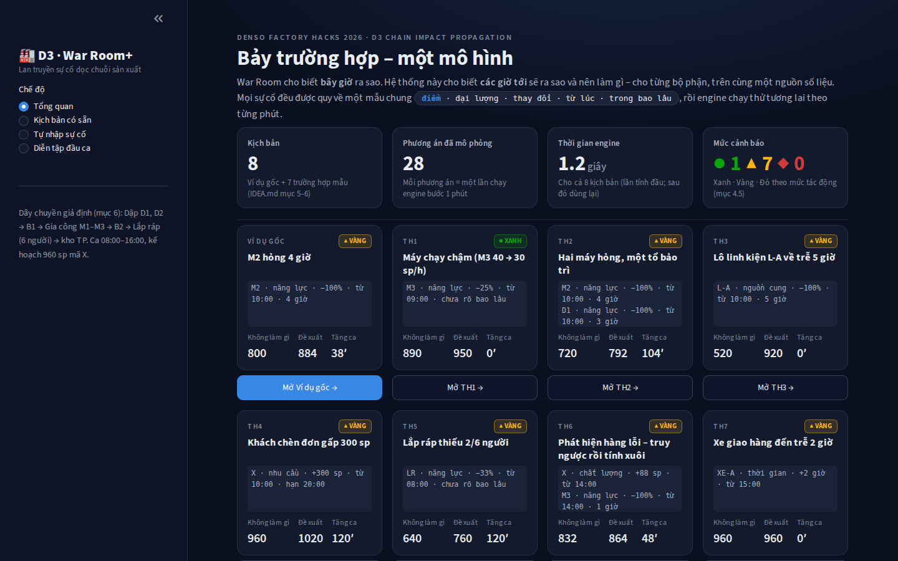
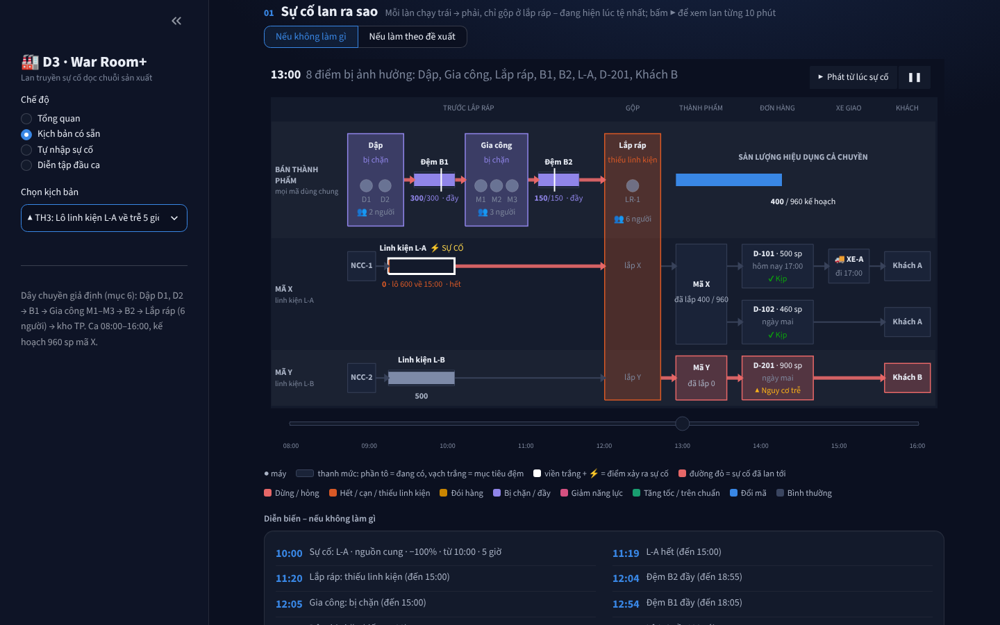

# Demo D3 – Chain Impact Propagation

Bản demo chạy trên máy local cho ý tưởng trong [`IDEA.md`](../IDEA.md). Người dùng chọn hoặc mô tả một sự cố,
hệ thống trả về:

- dòng thời gian tác động;
- sản lượng dự đoán;
- các phương án xử lý (số cứu được, chi phí, giờ tăng ca, mức xáo trộn);
- mức cảnh báo Xanh/Vàng/Đỏ;
- đồng hồ quyết định: mỗi phương án phải quyết muộn nhất lúc nào;
- câu trả lời riêng cho Bảo trì, Kế hoạch và Giao hàng & Sales.

## Cách chạy

Cần Python 3.10 trở lên.

```bash
cd C:\denso2026\demo            # hoặc: cd denso2026/demo
python -m pip install -r requirements.txt pytest
python -m pytest -q             # 95 passed
cd ..
streamlit run demo/app.py       # mở http://localhost:8501 (chạy từ gốc repo để nạp .streamlit/config.toml)
```

Nên dùng `python -m pytest` thay cho `pytest`, để chắc chắn test chạy đúng bộ Python đã cài thư viện.
Trên Windows có thể bấm đúp `run.bat`: cài thư viện, chạy test rồi mở giao diện.

Khi đang chạy, Streamlit chỉ tự nạp lại `app.py`. Sửa `engine.py`, `scenarios.py` hay `config.yaml` thì phải tắt
rồi chạy lại (`run.bat` hoặc `streamlit run demo/app.py` từ gốc repo), nếu không giao diện vẫn dùng engine cũ và có thể báo lỗi.

Giao diện có bốn chế độ ở thanh bên: **Tổng quan** (8 kịch bản trên một màn hình), **Kịch bản có sẵn**,
**Tự nhập sự cố** và **Diễn tập đầu ca**. Xem mục "Giao diện" bên dưới.

## Các file

| File | Nội dung |
|---|---|
| `config.yaml` | Dây chuyền giả định ở mục 6: Dập D1, D2 → B1 → Gia công M1–M3 → B2 → Lắp ráp (6 người) → kho thành phẩm; linh kiện L-A/L-B; đơn D-101, D-102, D-201; xe giao; line 2; phân bố thời gian sửa; đơn giá. Những thông số tài liệu không nêu đều ghi "giả định demo". |
| `engine.py` | Lớp Logic (đồ thị networkx) và lớp Nghiệp vụ (mô phỏng bước 1 phút), cùng thang xử lý, mức cảnh báo, thời gian chịu đựng của đệm, thứ tự sửa máy, truy vết ngược, phân tích giao hàng và câu trả lời cho từng bộ phận. |
| `scenarios.py` | 8 kịch bản (ví dụ gốc và TH1–TH7) và bảng phả hệ sản phẩm tự tạo cho TH6. |
| `app.py` | Giao diện Streamlit tiếng Việt: tổng quan, trang sự cố, tự nhập, diễn tập đầu ca. |
| `giao_dien.py` | Phong cách "War Room" tối: màu, CSS, template Plotly và các thẻ HTML dùng chung. |
| `.streamlit/config.toml` | Theme tối của Streamlit (nạp khi chạy từ thư mục `demo`). |
| `tests/test_scenarios.py` | Mỗi assert ứng với một con số trong tài liệu. |
| `tests/test_dong_ho.py` | Đồng hồ quyết định: số tài liệu ở mục 7.3. |
| `tests/test_dau_ca.py` | Diễn tập đầu ca: số tài liệu ở mục 7.1 và tính chất của bản đồ rủi ro, mức đệm, Monte Carlo. |
| `tests/test_dong_ho.py` | Đồng hồ quyết định: số tài liệu ở mục 7.3 và tính chất của cách tính. |
| `run.bat` | Chạy nhanh trên Windows. |

## Engine hoạt động thế nào

1. **Lớp Logic.** Đồ thị có hướng gồm máy, công đoạn, đệm, kho thành phẩm, linh kiện, nhà cung cấp, mã hàng, đơn hàng, khách hàng, chuyến xe và tổ người vận hành. Các cạnh mang tên quan hệ: *chạy trên*, *đưa vào*, *đệm cho*, *cấp cho*, *thành phần của*, *đáp ứng đơn*, *giao cho*, *chở bởi*, *vận hành*. Thứ tự dòng chảy lấy bằng sắp xếp topo trên đồ thị, nên thêm công đoạn hay đệm chỉ cần sửa `config.yaml`.
2. **Mẫu nhiễu chung** `Nhieu(điểm, đại lượng, thay đổi, bắt đầu, thời lượng)`, với 5 đại lượng:
   - năng lực: máy, hoặc cả công đoạn khi thiếu người;
   - nguồn cung: lô linh kiện;
   - nhu cầu: đơn gấp;
   - thời gian: chuyến giao;
   - chất lượng: giữ hàng nghi lỗi.

   Hành động khắc phục cũng dùng đúng mẫu này, ví dụ điều người (+16,7% năng lực Lắp ráp), tách lô hay đặt gấp linh kiện.
3. **Mô phỏng bước 1 phút**, đi từ cuối chuyền lên đầu chuyền. Sản lượng mỗi công đoạn = min(năng lực, đầu vào có trong đệm trước, linh kiện, chỗ trống ở đệm sau). Nhờ vậy sự cố lan cả hai chiều: xuôi (đói hàng) và ngược (bị chặn). Các quy tắc đã cài:
   - chạy trên chuẩn tối đa 6 giờ/ca;
   - tăng ca tối đa 4 giờ và chỉ chạy ở tốc độ chuẩn;
   - tiêu hao linh kiện theo BOM;
   - đổi mã mất 20 phút;
   - máy chạy chậm bất thường không được tăng tốc;
   - công đoạn thiếu người không chạy nhanh hơn nhịp của số người còn lại.
4. **Ba mức vận hành** đúng với thang xử lý:
   - 0 – không làm gì;
   - 1 – chia tải: giữ nhịp 120 sp/h; các máy còn lại gánh phần thiếu theo tỷ lệ công suất tối đa;
   - 2 – tăng tốc: chạy tới mức tối đa cho phép để đuổi kịp kế hoạch.

   Ngoài ra còn các lựa chọn đổi thứ tự, tăng ca, điều người, tách lô.
5. **Sản lượng hiệu dụng** = sản lượng ra khỏi Lắp ráp − hàng bị giữ + Σ min(0, mức đệm − mục tiêu). Đây là cách viết tổng quát của quy ước "tính tại nút cổ chai, đệm phải trả về mức mục tiêu". Rút đệm không được tính là cứu sản lượng. Giao diện vẫn hiện riêng sản lượng từng công đoạn để đối chiếu.
6. **Tác động** = mô phỏng có nhiễu − mô phỏng theo kế hoạch.
7. **Giờ tăng ca** là số phút sau 16:00 để sản lượng hiệu dụng đạt kế hoạch. Kho thành phẩm cũng là một đệm, nên không dùng để giảm giờ tăng ca, nhưng được tính khi kiểm tra đơn.
8. **Kiểm tra đơn hàng.** D-101 phải đủ trước xe 17:00. Đơn ngày mai phải vừa một ca, có tính thời gian đổi mã và thời gian bù các đệm bị thiếu.
9. **Mức cảnh báo** theo mục 4.5:
   - Xanh: chỉ cần chia tải hoặc tăng tốc, không tăng ca, đơn vẫn đủ;
   - Vàng: cần tăng ca, đổi thứ tự hoặc điều người, đơn vẫn kịp;
   - Đỏ: không phương án nào giữ được đơn.

   Phương án đề xuất là phương án ít giờ tăng ca nhất, rồi đến bậc thang thấp nhất, rồi ít xáo trộn kế hoạch nhất
   (ít đổi mã, ít thay đổi), rồi đến chi phí thấp nhất (`khoa_chon` trong `engine.py`). Ví dụ TH3: "NCC tách lô" và
   "Đổi thứ tự + tăng tốc" cùng không tăng ca, cùng bậc; chọn NCC tách lô vì không phải đổi mã, dù đắt hơn ~150.000 VND.
   Sự cố giao hàng (TH7) chọn phương án giao kịp hạn và rẻ nhất. Con người vẫn là bên chọn.

## Kết quả kiểm tra so với tài liệu

`python -m pytest -q` cho **84 passed** (58 test số tài liệu mục 5–6, 14 test diễn tập đầu ca, 12 test đồng hồ quyết định). GitHub Actions chạy cùng bộ test trên Python 3.10 và 3.12 mỗi lần push.

**Mục 5–6:** Engine không được chỉnh cho khớp số tài liệu. Lần chạy đầu có 5 chỗ bản tính tay lệch mô phỏng (đánh dấu `xfail`); sau khi xem lại, IDEA.md đã được sửa theo mô phỏng (mục 10), và các test đó nay kiểm số mới.

**Khớp tài liệu (mô phỏng bước 1 phút):**

| Trường hợp | Con số |
|---|---|
| Ví dụ gốc | Không làm gì 800; chia tải + tăng tốc 884; tăng ca 38 phút; sửa 3/4/5/6 giờ → 930/884/838/792 sp và tăng ca 15/38/61/84 phút; Vàng |
| TH1 | M1 = 45,96 ≈ 46, M2 = 44,04 ≈ 44; thiếu 10 sp, kho bù → Xanh; M3 hỏng hẳn 12:00 → 842 sp, tăng ca 89 phút ≈ 1,5 giờ |
| TH2 | Sửa M2 trước: Gia công 848 sp, B1 còn 12, hiệu dụng 660, tăng ca 180 phút ≈ 3 giờ. Sửa D1 trước: 792 sp, B1 còn 218, tăng ca 104 phút ≈ 1 giờ 45 → chọn D1 trước |
| TH3 | 11:20 L-A cạn, 12:05 B2 đầy, 12:55 B1 đầy; không làm gì mất 440; đổi thứ tự mất 80 (480 X + 400 Y), tăng ca 40 phút; đổi thứ tự + tăng tốc 0 phút; ngưỡng lô 16:05 |
| TH4 | Đơn C xong 18:00 (A), 18:30 (B); engine tự phát hiện thiếu 260 L-A |
| TH5 | 640 / 760 (tăng ca 2 giờ) / 880 (tăng ca 40 phút); B chỉ khả thi khi line 2 dư năng lực; cơ hội bảo dưỡng Gia công 08:00–10:00 |
| TH6 | Truy ngược ra M3 + lô S-77; hai giả thuyết 600 và 88 sp; lấy mẫu S-77 trên M1/M2 ra 0 lỗi → giữ 88 sp; tính xuôi 846 sp; tăng ca 57 phút (48 phút nếu tăng tốc); đặt gấp 48 L-A |
| TH7 | Hàng đến khách 20:30, trễ 1,5 giờ; Vàng |

**Đã sửa trong IDEA.md sau khi mô phỏng** (bản tính tay ban đầu → số mô phỏng, kèm lý do):

1. **TH2: sửa D1 trước (bản tính tay chọn M2).** Sửa M2 trước cho Gia công 848 sp nhưng rút B1 từ 200 xuống 12. Áp đúng quy ước "đệm phải trả về mức mục tiêu" thì:
   - sửa M2 trước: sản lượng hiệu dụng khoảng 660, cần khoảng 180 phút tăng ca để vừa đủ kế hoạch vừa trả đệm;
   - sửa D1 trước: 792 sp, cần khoảng 104 phút.

   Nguyên nhân: dây chuyền cân bằng (mọi công đoạn chuẩn 120 sp/h). D1 hỏng làm Dập hụt 50 sp/h, M2 hỏng chỉ làm Gia công hụt 28 sp/h. Đệm B1 chỉ hoãn thiệt hại của D1 sang sau 16:00, không xóa được nó. Bản tính tay chỉ so sản lượng Gia công lúc 16:00. Giao diện hiện cả hai thước đo để đội quyết định.
2. **TH2: tăng ca khi sửa M2 trước ≈ 3 giờ.** Bản tính tay ghi 1 giờ 20, chỉ bù 112 sp ở Gia công và chưa trả B1 (thiếu 188). Engine ra 180 phút.
3. **TH3: ngày mai không "vừa một ca".** 450 X + 500 Y = 950 sp, nhưng hai mã cần một lần đổi mã 20 phút (bằng 40 sp) nên thành 990 > 960. Engine đề xuất khoảng 40 phút tăng ca hôm nay cho phương án đổi thứ tự. Phương án đổi thứ tự kết hợp tăng tốc thì không cần tăng ca.
4. **TH6: tăng ca ≈ 57 phút (bản tính tay 42).** Bản tính tay trừ 30 sp kho thành phẩm ở TH6 (84 sp → 42 phút) nhưng không trừ ở mục 5 (76 sp → 38 phút); hai số này không thể cùng đúng. Engine dùng một quy ước cho mọi trường hợp (không trừ kho), nên ra 114 sp → 57 phút ở mức chia tải, 48 phút nếu có tăng tốc. Engine còn phát hiện thêm: giữ 88 sp làm nhu cầu L-A thành 1048 > 1000, nên phải đặt gấp 48 L-A.
5. **TH7: mức Vàng (bản tính tay ghi Đỏ).** Có phương án giữ đơn đúng hạn (thuê xe ngoài, đến 18:30), nên theo định nghĩa ở mục 4.5 là Vàng.

Hai lưu ý không làm đổi kết quả:

- Ở mục 5, khung 14:00–16:00 Gia công chạy 138 sp/h, cao hơn mức tối đa 130 của Lắp ráp. Phần dư dồn vào B2, nên sản lượng hiệu dụng không đổi.
- TH4 chỉ đạt 18:00/18:30 khi đặt gấp 260 L-A, về trước 15:50 (A) hoặc 16:20 (B). Engine tự sinh hành động này, đúng như câu "sự cố này tự sinh ra trường hợp 3" trong tài liệu.

## Diễn tập đầu ca (mục 7.1–7.2)

Chạy trước khi vào ca, khi chưa có sự cố. Dùng lại đúng engine và mẫu nhiễu chung:

- **Bản đồ rủi ro:** lần lượt cho từng máy hỏng (mặc định lúc 10:00), thời gian sửa lấy ở mức 80% của phân bố
  (= dự kiến + 1 giờ). Ưu tiên bảo trì = xác suất hỏng trong ca × số sản phẩm mất nếu hỏng (mục 4.6).
  Kết quả với thông số giả định: M3 (máy cũ, 10%/ca) xếp đầu dù mất ít nhất khi hỏng; LR-1 mất nhiều nhất (330 sp)
  vì Lắp ráp không có máy dự phòng.
- **Mức đệm đề xuất:** hụt khi máy tệ nhất phía trước hỏng × thời gian sửa mức 80%, không vượt sức chứa.
  Khớp ví dụ mục 7.1: B2 khi M2 hỏng cần 28 × 5 = 140 sp (thêm 80 sp so với 60). Máy tệ nhất là M1
  (hụt 30 sp/h) nên đề xuất 150 = sức chứa. B1 hiện 200 sp đã đủ cho D1 hỏng 4 giờ.
- **Xác suất hoàn thành kế hoạch:** chạy kế hoạch ca qua 300 kịch bản rủi ro rút ngẫu nhiên, mỗi rủi ro là một nhiễu:
  máy hỏng (xác suất theo máy), thời gian sửa lệch dự kiến (theo `phan_bo_sua`), dừng ngắn 5–30 phút.
  Engine không biết trước các rủi ro này. Phản ứng: chia tải + tăng tốc. Ra xác suất đủ kế hoạch trong ca, giờ tăng ca
  nên đăng ký trước (đủ cho 80% kịch bản), xác suất đơn hôm nay kịp, và tác động trung bình khi từng máy hỏng.

Kết quả với thông số giả định (seed 7, 300 kịch bản): đủ kế hoạch trong ca 42%; đăng ký trước 38 phút tăng ca là đủ cho
80% kịch bản; đủ kế hoạch nếu tăng ca ≤ 4 giờ 99,7%; D-101 kịp 100%.

Hai điều mô phỏng cho thấy:

- **42% là thấp vì kế hoạch kín 100% công suất chuẩn** (960 = 120 sp/h × 8 giờ). Sự cố sớm trong ca được tăng tốc
  bù kịp; nhưng một lần dừng ngắn sát 16:00 không còn thời gian bù, nên vẫn cần vài phút tăng ca.
- **Đệm dày hơn không giảm giờ tăng ca** theo quy ước "đệm phải trả về mục tiêu". Nâng B2 lên 150 giữ cho Lắp ráp
  ra đủ 960 sp lúc 16:00 khi M1 hỏng 5 giờ (thay vì 878), nhưng giờ tăng ca vẫn 66 phút vì phần đệm đã dùng phải
  bù lại. Đệm dày chỉ có lợi nếu được bù bằng năng lực dư ở ca sau (ví dụ Gia công chạy trên chuẩn) – điều quy ước
  hiện tại chưa tính. Giao diện đặt hai con số cạnh nhau để Kế hoạch quyết định.

Giản lược: các máy hỏng cùng lúc được sửa song song (chưa xét giới hạn một tổ bảo trì như TH2); xác suất hỏng, thời
gian sửa và dừng ngắn là giả định demo trong `config.yaml`.

## Đồng hồ quyết định (mục 7.3)

Trên giao diện: chỉ số "⏱ Đồng hồ quyết định" ở đầu trang sự cố và thanh thời gian ở mục 02. Với mỗi phương án, engine chạy lại như thể phương án
được quyết lúc t: trước t dây chuyền chạy như không làm gì, hành động lẽ ra bắt đầu sớm hơn dời tới t (giữ giờ kết thúc).
Từ đó ra ba mốc:

- **Muộn nhất không mất gì:** phút cuối cùng mà sản lượng 16:00, giờ tăng ca đề xuất và đơn hàng vẫn như khi quyết ngay
  lúc phát hiện. Quét mỗi 15 phút rồi tìm nhị phân trong khoảng đầu tiên bị mất. Không tìm nhị phân trên cả ca vì kết quả
  có thể không đơn điệu (xem TH3 bên dưới).
- **Mỗi phút chậm mất:** độ dốc trung bình trong 30 phút sau mốc, tính theo sản phẩm và theo phút tăng ca.
- **Hết hiệu lực:** lần đầu phương án không còn giữ được đơn, kể cả khi tăng ca tối đa 4 giờ.

Khớp mục 7.3:

| Tài liệu | Mô phỏng |
|---|---|
| TH3: phải quyết đổi thứ tự trước 11:20 (kho L-A cạn) | 11:20 |
| TH3: sau đó mỗi phút chậm mất 2 sp | 2,0 sp/phút (thêm 1 phút tăng ca mỗi phút chậm) |
| TH4: phương án A chỉ còn hiệu lực nếu tăng tốc từ 10:00 | 10:00 – phải quyết ngay |

Những điều mô phỏng cho thấy thêm:

- **TH3 – đổi thứ tự quá muộn còn hại hơn không làm gì.** Quyết sau 14:20 thì Lắp ráp vừa đổi sang Y, lô L-A về
  lúc 15:00 lại phải đổi về X: mất thêm 40 phút đổi mã, kém hơn không làm gì (520 sp, 220 phút tăng ca). Sau 14:40
  thì cần hơn 4 giờ tăng ca và mất đơn D-101. Từ 15:00 đổi thứ tự không còn tác dụng.
  NCC tách lô cũng có mốc 11:20 (450 L-A phải về trước khi kho cạn).
- **TH1 – tăng tốc ngay chưa chắc tốt nhất.** M3 chạy chậm từ 09:00. Nếu tăng tốc ngay, giới hạn 6 giờ trên chuẩn hết lúc
  15:00 và ca ra 950 sp. Đợi đến 10:00 mới tăng tốc thì chạy cao tải đúng 10:00–16:00 và ca ra 960 sp. Đồng hồ vì vậy
  cho mốc 11:43. Cách chạy "tăng tốc ngay khi thiếu" của engine chưa tối ưu được thời điểm bắt đầu tăng tốc.
- **TH5 – điều người từ line 2:** mốc 10:00 chính là giờ người được điều tới theo kịch bản.
- **Phương án không phụ thuộc thời điểm** (vd. TH4 phương án B chỉ tăng ca) ghi "quyết lúc nào trong ca cũng như nhau".
- **TH7** chỉ có sự cố giao hàng, không đổi dòng chảy sản xuất nên không có mốc cho sản xuất.

Giản lược: chưa tính thời gian chuẩn bị (gọi NCC, điều người, họp thống nhất) – quyết lúc t thì hành động có hiệu lực
ngay lúc t. Muốn tính thêm thì trừ thời gian chuẩn bị khỏi mốc.

## Giao diện

Phong cách "War Room" tối, thiết kế cho giám khảo xem gần trên laptop (1440×900): tóm tắt ở màn hình đầu, chi tiết
xếp lớp bên dưới. Không thêm thư viện – chỉ theme Streamlit, CSS và Plotly.

- **Tổng quan:** 8 kịch bản dạng thẻ (mẫu nhiễu, mức cảnh báo, sản lượng không làm gì / đề xuất, tăng ca), bấm để mở.
- **Trang sự cố:** mức cảnh báo, 4 chỉ số (sản lượng, thiếu, tăng ca, đồng hồ quyết định), thẻ đề xuất; rồi
  01 bản đồ lan truyền dạng làn song song (bán thành phẩm + một làn mỗi mã: linh kiện → lắp ráp → thành phẩm → đơn →
  xe → khách; chỉ gộp ở lắp ráp, đệm/linh kiện là thanh mức, đường đỏ = sự cố đã lan tới) – mở sẵn ở lúc tệ nhất,
  nút ▶ phát lại từng 10 phút từ lúc sự cố, chuyển
  "không làm gì ↔ đề xuất"; 02 thẻ phương án, biểu đồ cứu được và thanh đồng hồ quyết định; 03 câu trả lời từng bộ phận;
  04 chi tiết kỹ thuật (Gantt, đệm, linh kiện, bảng số, đối chiếu IDEA.md).
- Màu trạng thái cố định theo nghĩa (dừng/hỏng, hết/cạn, đói hàng, bị chặn/đầy, tăng tốc, đổi mã), luôn kèm chú giải
  chữ; bảng màu danh mục đã kiểm tra tương phản và mù màu trên nền tối.
- Thời gian engine hiển thị là thời gian thật của lần tính đầu (sau đó dùng lại từ bộ nhớ đệm).




## Giả định của bản demo

- Toàn bộ dữ liệu là tự tạo, theo đúng bảng ở mục 6. Đơn giá chi phí, sức chứa kho thành phẩm, số người ở Dập và Gia công, năng suất line 2 và giờ xe báo trễ (15:00) là giả định demo, đặt trong `config.yaml`.
- X và Y dùng chung Dập và Gia công; đệm không phân biệt mã. Định mức 1 linh kiện cho mỗi sản phẩm.
- Thời gian xuyên chuyền (20 phút) chỉ dùng để diễn giải. Mô hình coi việc chuyển hàng qua đệm là tức thời.
- Bảng phả hệ TH6 có cơ chế lỗi ẩn mà engine không biết trước: chỉ M3 khi chạy 44 sp/h mới sinh lỗi. Truy vết phải tự tìm ra điều này bằng điểm chung và lấy mẫu.

## Hướng mở rộng (ngoài phạm vi demo)

- **Dữ liệu thật:** nối lakehouse của nhà máy (tình trạng máy, tồn đệm, MES theo lô hoặc sản phẩm, đơn hàng, lịch xe) vào hai bảng điểm và quan hệ; hiệu chỉnh hiệu suất thực và công suất tối đa theo dữ liệu (mục 7.4).
- **Weibull và cảnh báo trước khi hỏng (mục 4.6):** ước lượng xác suất hỏng trong 24 giờ từ lịch sử phiếu sửa; ưu tiên bảo trì = xác suất hỏng × số sản phẩm mất nếu hỏng, con số sau lấy từ chính engine này.
- **LLM (mục 7.6):** dịch câu hỏi bằng lời thành mẫu nhiễu và dịch kết quả ra lời. Engine vẫn là bên tính số.
- **Neo4j hoặc graph database:** khi số dây chuyền, lô và đơn lớn. Bản demo dùng networkx trong bộ nhớ.
- Mô phỏng theo sự kiện cho nhiều sự cố chồng nhau, quy đổi mọi phương án ra tiền (mục 7.7), kho tri thức sự cố (mục 7.5).
- Diễn tập đầu ca với dữ liệu thật: thay xác suất hỏng bằng Weibull theo giờ chạy, thêm rủi ro nguồn cung và thiếu người, xét giới hạn một tổ bảo trì.
